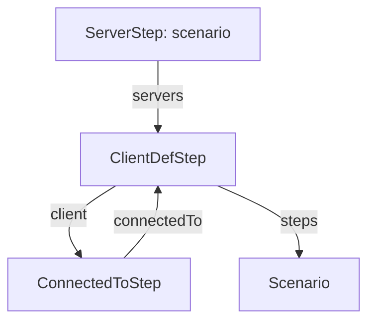
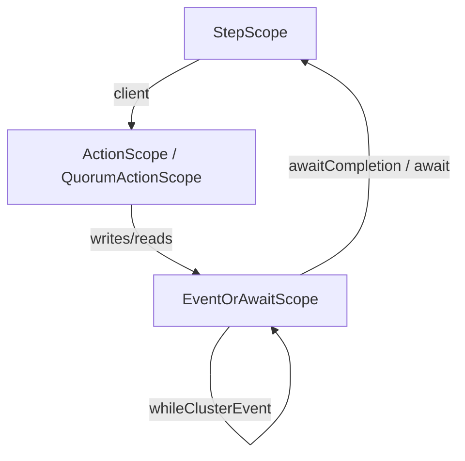

# Scenario DSL

This directory contains the internal Domain-Specific Language (DSL) for declaring distributed-system test scenarios in Tickloom. It provides a declarative, type-safe, and fluent API to define network topologies, client connections, and sequential protocol steps with injected network faults.

This DSL is built using three primary fluent API patterns:
1. **Progressive Interfaces**
2. **Nested Closure**
3. **Simulated Self-Type**

## 1. Target Syntax

The target syntax cleanly separates topology definition from the actual scenario steps, ensuring a linear progression. 

```java
Scenario<QuorumReplicaClient> s = QuorumStepBuilder.scenario("quorum write")
    .servers(ATHENS, BYZANTIUM, CYRENE)
    .client(WRITER).connectedTo(ATHENS)
    .client(ALICE).connectedTo(BYZANTIUM)
    .steps(s -> {
        // Step 1: Write initial value
        s.client(WRITER).writes("key", "v1").awaitCompletion();
        
        // Step 2: Delay replication and write new value
        s.client(WRITER).writes("key", "v2")
            .whileClusterEvent(new DelayMessages(
                QuorumMessageTypes.INTERNAL_SET_REQUEST, ATHENS, List.of(BYZANTIUM), 100))
            .await(cluster -> athensHas(cluster, "v2"));
    });

s.run();
```

## 2. Core Patterns Used

### 2.1 Progressive Interfaces
The DSL strictly enforces the order of operations by returning a different interface at each step of the builder chain. This makes it impossible to define steps before the topology, or to define an action before a client is selected.



Inside the `.steps(Consumer)` block, the per-step grammar is similarly constrained:


### 2.2 Nested Closure
The `.steps(Consumer<StepScope<T>>)` method utilizes a nested closure. This creates a clean lexical scope where the user defines multiple sequential steps using the provided `StepScope`. 

By accepting an interface (`StepScope`) instead of the concrete builder class, we ensure that the lambda body cannot access topology methods like `.servers(...)` which shouldn't be visible inside a step block.

### 2.3 Simulated Self-Type & Hidden Implementations
To support multiple protocols (e.g., Quorum, Paxos, Raft) without duplicating the core DSL machinery, the base DSL is fully decoupled from protocol-specific verbs.

The base `StepBuilder` is parameterized with a simulated self-type `T extends ActionScope`. 
```java
public abstract class StepBuilder<C extends ClusterClient, T extends ActionScope> implements StepScope<T> {
    public final T client(ProcessId id) { ... return actionBuilder(); }
    protected abstract T actionBuilder();
}
```

Protocol implementors then define their own `ActionScope` interface and a subclass of `StepBuilder`:
```java
// The narrow grammar projection exposing protocol-specific verbs
public interface QuorumActionScope extends ActionScope {
    EventOrAwaitScope<QuorumActionScope> writes(String key, String value);
    EventOrAwaitScope<QuorumActionScope> reads(String key);
}

// The hidden concrete builder
public final class QuorumStepBuilder extends StepBuilder<QuorumReplicaClient, QuorumActionScope> implements QuorumActionScope {
    // static entry point
    public static ServerStep<QuorumReplicaClient, QuorumActionScope> scenario(String name) { ... }
    
    // implement the verbs...
}
```
All implementation details (`ScenarioBuilderImpl`, `StepBuilder`, etc.) are hidden. The user only ever interacts with the static entry point (e.g., `QuorumStepBuilder.scenario(...)`) and the public scope interfaces.

## 3. The Semantic Model

The builder chain produces a `Scenario` object (found in `semanticmodel/`). The Semantic Model is entirely separate from the DSL builder. It is a pure representation of the scenario:
- `Scenario`: Contains the topology (`ServerDefs`, `ClientDefs`) and a list of `Step`s.
- `Step`: Contains an `Action` (like read or write) and a list of `ClusterEvent`s (fault injections).
- `ClusterEvent`: Faults like `Partition`, `Reconnect`, `DelayMessages`, etc.

The DSL builder compiles down to this semantic model, which can then be executed (`.run()`) to produce a `JepsenHistory` for consistency checking.

## 4. Extending for New Protocols

To add a new protocol (e.g., Raft):
1. **Create an ActionScope interface:** e.g., `RaftActionScope extends ActionScope` with your protocol's verbs (e.g., `propose`, `readIndex`).
2. **Create a StepBuilder subclass:** e.g., `RaftStepBuilder extends StepBuilder<RaftClient, RaftActionScope> implements RaftActionScope`.
3. **Provide a static entry point:** Add a `public static ServerStep<...> scenario(String name)` method to your builder that delegates to `Scenarios.scenario(...)` and wires up the `RaftReplica` and `RaftClient` factories.
